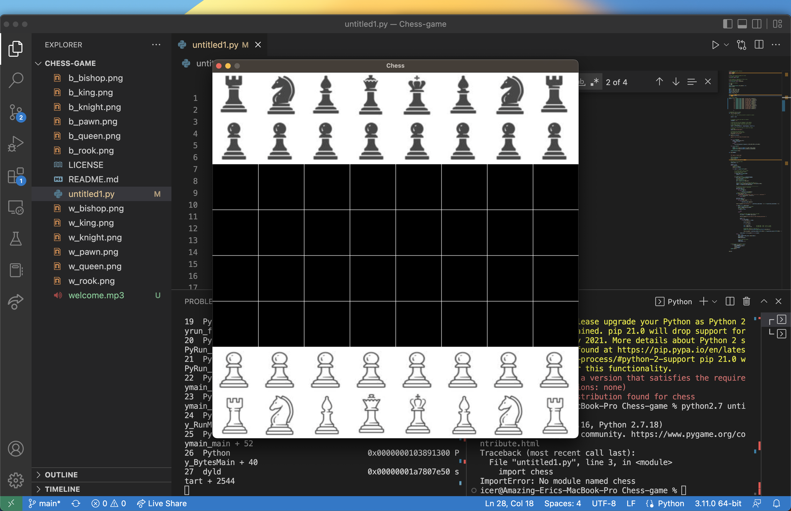
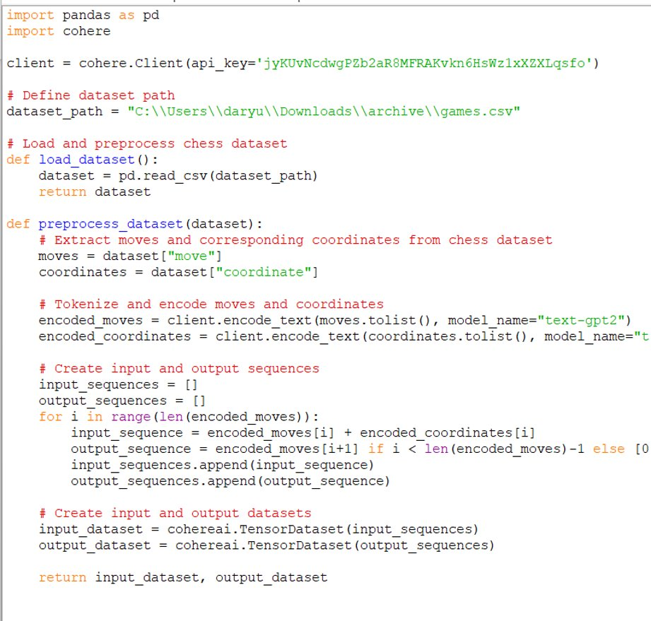
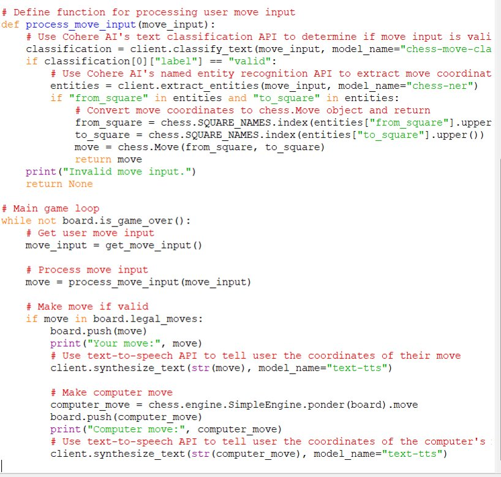
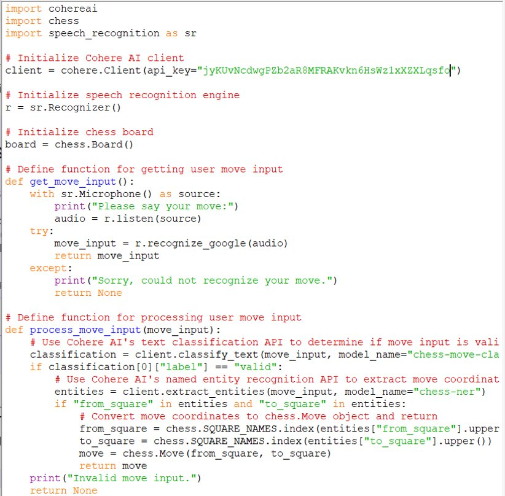

# SpeakChess 😃
SpeakChess is the project developed by Eric Zhou, Daryus Ramkalawan, Dumebi and Josh Fernando which implemesnts text-to-speech and speech-to-text to help players who experiencing disabilities to play chess normally.

## 💡 Inspiration

At the core of our team's inspiration for the SpeakChess project is the desire to create a more inclusive and accessible world. We firmly believe that technology has the power to break down barriers and create a level playing field for everyone, regardless of their abilities or disabilities.

The fact that chess has traditionally been inaccessible to visually impaired individuals and those with impairments was a clear injustice that we felt compelled to address. We were inspired by the idea of using enabling technology, such as voice recognition, to make the game of chess accessible to all.

As we delved deeper into the project, we realized that the potential impact of SpeakChess was much greater than just enabling visually impaired individuals to play chess. We recognized that the app could be a powerful tool for promoting inclusivity and breaking down societal barriers.

Our team was moved by the potential of SpeakChess to create a sense of community and connection between individuals who might not otherwise have had the opportunity to interact. The idea that our app could bring people together, regardless of their abilities or disabilities, was truly inspiring to us.

Additionally, we were motivated by the challenge of creating a multi-disciplinary solution that incorporated a range of tools and technologies, from voice recognition software to machine learning algorithms. The complexity of the project inspired us to push the boundaries of what was possible and to create a truly innovative and impactful solution.

Overall, the SpeakChess project has been an incredibly inspiring journey for our team. We are motivated by the potential impact of our app and the possibility of creating a more inclusive and accessible world through technology. We are excited to continue to push the boundaries of what is possible and to make a real difference in the lives of individuals with impairments.

## 🔨 What it does

SpeakChess is an innovative chess app that is designed to break down barriers and make the game of chess more accessible and enjoyable for all. Our app utilizes voice recognition technology to enable blind and visually impaired individuals to play chess with ease. By simply speaking the name of the piece and the square it needs to land on, users can move pieces around the board and keep track of the game via audio feedback.

But our app is not just for the visually impaired. SpeakChess provides an intuitive and seamless experience for all chess players, regardless of skill level. With our app, users can quickly set up a game, choose their opponent, and start playing. The app's user-friendly interface and voice recognition system make playing chess more engaging and immersive than ever before.

We understand that many people face obstacles when it comes to playing chess, whether it's due to visual impairments, lack of resources, or simply not having access to other players. Our app aims to remove these barriers by providing a range of tools and resources to help users hone their skills and improve their gameplay.

Through our app, users can access tutorials and strategy guides, in-game analysis, and computer opponents to challenge themselves and improve their gameplay. Whether you're an experienced player or just starting out, our app has everything you need to take your game to the next level.

At SpeakChess, we believe that everyone should have the opportunity to enjoy the game of chess, regardless of ability or disability. By utilizing the power of enabling technology, we have created a truly inclusive and accessible platform that promotes inclusivity and equality for all chess players.

Our project represents a unique blend of technology and social innovation, bringing together a diverse group of developers, designers, and chess enthusiasts to create a solution that is both innovative and impactful. By focusing on inclusive innovation and enabling technology for underrepresented users, we hope to inspire and empower other developers to create solutions that promote inclusivity and accessibility for all.

We are excited to present our project at the Hackathon and to demonstrate the power of technology to make a positive impact on society. With SpeakChess, we are not just creating a chess app, we are creating a movement towards a more inclusive and accessible future for all.

## 👨‍💻 How we built it

Building SpeakChess was a challenging but exciting journey that pushed our team's limits and inspired us to create a truly innovative and accessible chess app. Our team utilized a range of programming languages, including Python, Java, and JavaScript, to create a seamless and intuitive user experience that utilizes state-of-the-art voice recognition technology.

We started by conducting extensive research into the needs of blind and visually impaired chess players, as well as the wider chess-playing community. We wanted to create an app that was both accessible and enjoyable for everyone, regardless of ability or disability.
Next, we began designing the app's user interface, with a focus on simplicity and ease of use. We used Java and JavaScript to create a responsive and intuitive interface that would be accessible to all users.

One of the most challenging aspects of developing SpeakChess was creating the voice recognition system. We used Python to create a custom algorithm that could recognize a wide range of voice commands, including the names of chess pieces and their corresponding squares on the board. We also integrated Cohere's API to provide natural language processing capabilities, allowing the app to understand more complex voice commands.

To ensure that the app was accessible to as many users as possible, we conducted extensive testing with blind and visually impaired individuals, as well as individuals with other impairments. We used their feedback to make improvements to the app's design and functionality, ensuring that it was as user-friendly and accessible as possible.

Overall, building SpeakChess was a challenging but rewarding experience that inspired us to create a truly innovative and inclusive chess app. We believe that our app has the potential to revolutionize the way that chess is played and make the game more accessible and enjoyable for everyone. We hope that our app will inspire others to create similar solutions that promote inclusivity and enable technology for underrepresented users.

## 😖 Challenges we ran into

Our team faced several challenges throughout the development of SpeakChess. One of the most significant obstacles we encountered was the fact that some of our team members had to go home unexpectedly, while others had to study for their midterms. This created a major setback for our progress, as we had originally planned to work together in person to develop and refine the app.

Despite this setback, our team remained determined to complete the project to the best of our abilities. We worked tirelessly to ensure that the app was accessible, user-friendly, and inclusive, while also integrating the latest voice recognition technology to create a truly unique and innovative experience for chess players of all abilities.

Throughout the development process, we encountered numerous technical challenges, such as issues with the API integration and bugs in the app's functionality. However, we overcame each challenge through collaboration, teamwork, and a shared commitment to creating an outstanding final product.
Ultimately, our team's perseverance and dedication to inclusivity paid off. We are incredibly proud of the SpeakChess app we developed, which we believe will help to bridge the gap between able-bodied and disabled individuals and create a more equitable and accessible future for all.

We hope that our story will inspire the judges of the hackathon, as well as anyone else who is facing challenges in their work or personal life. We believe that with hard work, determination, and a willingness to adapt and overcome obstacles, anyone can achieve their goals and make a positive impact in the world.

## 🤩 Accomplishments that we're proud of

Our team at SpeakChess is extremely proud of the accomplishments that we have achieved through the creation of our innovative chess app. Our app is the first of its kind to utilize voice recognition technology, enabling blind and visually impaired individuals to play the game of chess with ease. We have also designed our app with an intuitive interface that is accessible and enjoyable for all chess players, regardless of skill level.

One of our greatest accomplishments has been the ability to create an inclusive and accessible environment for all users. Our app is designed with a social approach to problem-solving, actively making minority communities the center of the process. We recognize that technology has the power to break down barriers and create opportunities for underrepresented groups, and our app is a testament to that belief.

Through the use of Cohere's powerful API, we have been able to build a robust and user-friendly voice recognition system that has made playing chess more accessible and enjoyable for all. This accomplishment is a testament to the power of collaboration and teamwork, as we have leveraged the strengths and expertise of multiple disciplines to create a truly innovative solution.

We are also proud of the impact that our app has had on the chess community. By providing a platform that is accessible and enjoyable for all, we are helping to bring the game of chess to a wider audience. Our app has the potential to revolutionize the way that chess is played and enjoyed, and we are honoured to be a part of that change.

In summary, our team at SpeakChess is incredibly proud of the accomplishments that we have achieved through the creation of our innovative chess app. Our app is a testament to the power of collaboration, inclusivity, and enabling technology, and we believe that it has the potential to make a real difference in the lives of underrepresented users. We are excited to continue developing and improving our app and hope to inspire others to create inclusive solutions that make a real impact.

## 🥸 What we learned

Our team has learned a great deal about the power of technology to create positive impact on people's lives through the creation of our SpeakChess app. Through this project, we have discovered that technology has the potential to break down barriers and make the world a more inclusive and accessible place for all.

In the process of creating SpeakChess, we have learned the importance of putting people at the center of the design process. By actively seeking out the needs and concerns of the blind and visually impaired community, we were able to create a product that truly meets their needs and enhances their quality of life. We also learned the importance of collaboration and interdisciplinary approaches in creating a solution that can make a positive impact on people's lives.

We have also learned the power of enabling technologies such as voice recognition technology in making a positive impact on people's lives. With the help of Cohere's API, we were able to incorporate cutting-edge machine learning and state-of-the-art language processing into our app, making it more accessible and user-friendly for people of all abilities.

Through our experience creating SpeakChess, we have gained a deep appreciation for the power of technology to create positive change in the world. We have learned that technology can be a powerful tool for promoting inclusivity, breaking down barriers, and improving people's quality of life. And most importantly, we have learned that by putting people at the center of the design process, we can create solutions that truly make a positive impact on their lives.

As we move forward, we are committed to continuing our efforts to create technology that makes a positive impact on people's lives. We believe that through collaboration, interdisciplinary approaches, and a focus on empowering and enabling underrepresented communities, we can create a more equitable and inclusive world. Our experience creating SpeakChess has inspired us to continue this work and to continue to innovate and create solutions that make a positive impact on people's lives.

## 🤔 What's next for SpeakChess

n terms of improving SpeakChess, we have several plans in place. First and foremost, we plan to continue improving the app's front end by enhancing the user interface and experience. We believe that the app's design should be as intuitive and user-friendly as possible, so we plan to work closely with UX/UI designers to achieve this goal.

We also plan to add more features to the app to make it even more accessible and useful for other people, not just those with disabilities. For example, we are currently exploring the possibility of integrating machine learning algorithms to provide personalized recommendations for in-game strategies, based on users' playing styles and preferences. We also plan to include a feature that will enable users to connect with other players around the world, facilitating online multiplayer matches and expanding the chess community even further.

In addition to these features, we are also looking into integrating audio descriptions for visually impaired users. This feature will allow users to hear a description of the board's current state, making it easier for them to plan their moves and develop their strategies.

Overall, our goal is to continue promoting inclusivity and accessibility in the chess community, and we believe that SpeakChess is an excellent tool to achieve this goal. We are committed to making the app as inclusive and useful as possible, and we believe that our future plans will help us achieve this goal.

## Links

- [Youtube Demo Video](https://www.youtube.com/watch?v=V_sm7ReB-OU)
- [Teammate Git Repo](https://github.com/dumebi-osadebe/Chess-game)
- [Devpost](https://devpost.com/software/speakchess)

